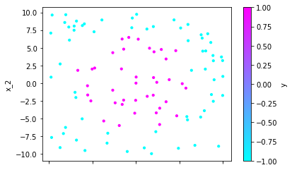

## Week 05 Report
#### Hans-Ole Hatzel, Rafael Epplée




The above graphs represent the trained model after 30 iterations. Point scale indicates the respective weights according to our distribution `D`. Points are colored according to the strong classifier output. Lines represent weak classifiers.

We trained 30 weak classifiers, for each picking the best from 100 random candidates.

```
α 0.24	threshold   4.86	feature x_1	parity  1
α 0.35	threshold   9.93	feature x_2	parity -1
α 0.40	threshold   6.30	feature x_2	parity  1
α 0.26	threshold  10.50	feature x_1	parity -1
α 0.40	threshold  -5.59	feature x_1	parity -1
α 0.26	threshold -10.50	feature x_2	parity  1
α 0.38	threshold   6.65	feature x_1	parity  1
α 0.27	threshold -10.13	feature x_1	parity  1
α 0.41	threshold  -6.02	feature x_2	parity -1
α 0.29	threshold -10.96	feature x_2	parity  1
α 0.34	threshold   5.84	feature x_1	parity  1
α 0.25	threshold   5.12	feature x_2	parity  1
α 0.35	threshold  10.34	feature x_1	parity -1
α 0.33	threshold  -5.61	feature x_1	parity -1
α 0.21	threshold -10.03	feature x_2	parity  1
α 0.34	threshold  -6.19	feature x_2	parity -1
α 0.25	threshold -10.09	feature x_1	parity  1
α 0.35	threshold   6.90	feature x_2	parity  1
α 0.26	threshold -10.61	feature x_2	parity  1
α 0.33	threshold   5.48	feature x_1	parity  1
α 0.23	threshold  -4.27	feature x_2	parity -1
α 0.31	threshold -10.72	feature x_2	parity  1
α 0.30	threshold   6.86	feature x_2	parity  1
α 0.23	threshold   9.88	feature x_2	parity -1
α 0.27	threshold  -5.66	feature x_1	parity -1
α 0.18	threshold  -4.68	feature x_2	parity -1
α 0.28	threshold -10.13	feature x_2	parity  1
α 0.33	threshold   7.30	feature x_1	parity  1
α 0.25	threshold -10.92	feature x_2	parity  1
α 0.27	threshold   6.58	feature x_2	parity  1
```
